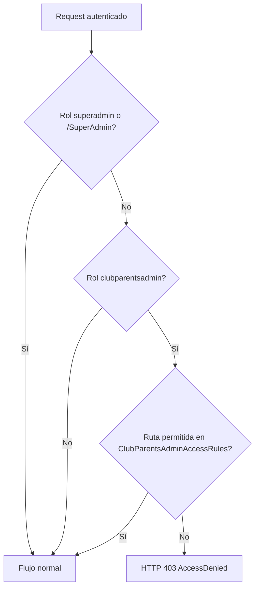

# Restricción visual y de seguridad — rol `clubparentsadmin`

**Fecha:** 2026-05-24  
**Rol objetivo:** `clubparentsadmin` (Administrador Club de Padres)  
**Alcance:** Solo este rol. SuperAdmin, `admin`, estudiantes y demás roles **no se modifican**.

---

## 1. Archivos modificados / creados

| Archivo | Acción |
|---------|--------|
| `Authorization/ClubParentsAdminAccessRules.cs` | **Creado** — reglas centralizadas de rutas permitidas |
| `Filters/ClubParentsAdminAccessFilter.cs` | **Creado** — filtro global MVC (HTTP 403, sin redirección) |
| `Views/Shared/_ClubParentsAdminSidebar.cshtml` | **Creado** — menú lateral exclusivo (3 ítems) |
| `Views/Shared/_AdminLayout.cshtml` | **Modificado** — menú condicional, navbar y marca |
| `Controllers/UserController.cs` | **Modificado** — `[Authorize(Roles = "admin,clubparentsadmin")]` |
| `Controllers/AuthController.cs` | **Modificado** — login → `/User/Index`; `AccessDenied` con 403 |
| `Program.cs` | **Modificado** — registro del filtro; evento cookie `OnRedirectToAccessDenied` |

**No modificados:** SuperAdmin, `MessagingService`, BD, enum de roles, permisos de otros roles, lógica de negocio de ClubParents.

---

## 2. Lógica aplicada

### 2.1 Capa visual (`_AdminLayout.cshtml`)

- Si `userRole == "clubparentsadmin"`:
  - Se renderiza solo `_ClubParentsAdminSidebar.cshtml`.
  - Se oculta el menú completo existente (envuelto en `else { ... }` — **código no eliminado**).
  - Navbar: sin enlace **Inicio** → Home.
  - Logo/marca apunta a `/User/Index`.
  - Se mantiene icono de mensajes y **Cerrar sesión**.

### 2.2 Capa backend — filtro global

`ClubParentsAdminAccessFilter` (`IAsyncActionFilter` registrado en `AddMvcOptions`):

1. Usuario no autenticado → no aplica (flujo normal de login).
2. Rol `superadmin` o ruta `/SuperAdmin/*` → **no aplica** (SuperAdmin intacto).
3. Rol distinto de `clubparentsadmin` → **no aplica**.
4. Rol `clubparentsadmin` + ruta no permitida → `ViewResult` `AccessDenied` con **StatusCode 403** (sin `RedirectToAction`).

### 2.3 Capa backend — autorización por cookie

`OnRedirectToAccessDenied` en `AddCookie`:

- Si el usuario es `clubparentsadmin` y falla un `[Authorize(Roles = "...")]` en otro controlador, se renderiza la vista 403 **sin** `Response.Redirect`.
- Otros roles conservan el redirect habitual a `/Auth/AccessDenied`.

### 2.4 Reglas centralizadas (`ClubParentsAdminAccessRules`)

Evaluación por **controlador**, **acción** y **path**:

- Path que empieza por `/ClubParents` → permitido.
- Controlador `Messaging` → todas las acciones.
- Controlador `User` → solo acciones usadas por `/User/Index` (ver sección 4).
- Controlador `File` → `GetSchoolLogo` (logo en layout).
- Controlador `Auth` → `Login`, `Logout`, `AccessDenied`.

### 2.5 Login

Tras login exitoso, `clubparentsadmin` redirige a **`/User/Index`** (no a Home).

### 2.6 Acceso a `UserController`

Se añade `clubparentsadmin` al atributo `[Authorize]` del controlador para que pueda usar la pantalla de usuarios. Las acciones no listadas en la whitelist siguen bloqueadas por el **filtro** (403).

---

## 3. Menús ocultados (solo `clubparentsadmin`)

Todo lo que estaba en el sidebar estándar excepto:

| Visible | Oculto (ejemplos) |
|---------|-------------------|
| Mensajería (Bandeja, Enviados, Nuevo) | Dashboard |
| Administrar Usuarios (`/User/Index`) | Cambiar contraseña |
| Club de Padres | Gestión contraseñas, Lotes de correo |
| | Estudiantes, Portal docente, Director, Reportes |
| | Administración (catálogos, asignaciones, horarios, etc.) |
| | Secretaría, Contabilidad, Carnets, Pagos, Prematrícula |

Navbar: sin **Inicio**; sin accesos secundarios a otros módulos.

---

## 4. URLs permitidas

| Área | Rutas / acciones |
|------|------------------|
| **Mensajería** | `/Messaging/*` (Inbox, Sent, Compose, Detail, APIs JSON, etc.) |
| **Usuarios** | `/User/Index`, `GetUserJson`, `CreateJson`, `UpdateJson`, `Delete`, `DeleteConfirmed`, `UpdatePhoto`, `RemovePhoto`, `SendPasswordEmail` |
| **Club de Padres** | `/ClubParents/Students`, `/ClubParents/Api/*`, `/ClubParents/Carnet/*`, `/ClubParents/Platform/*` |
| **Soporte** | `/Auth/Login`, `/Auth/Logout`, `/Auth/AccessDenied`, `/File/GetSchoolLogo` |
| **Estáticos** | `wwwroot` (CSS, JS, imágenes) — vía `UseStaticFiles`, sin filtro MVC |

**SuperAdmin:** `/SuperAdmin/*` — sin restricciones (rol y rutas excluidos del filtro).

---

## 5. URLs bloqueadas (ejemplos)

Cualquier otra ruta MVC para `clubparentsadmin` responde **HTTP 403** con vista `Views/Auth/AccessDenied.cshtml`:

| URL ejemplo | Motivo |
|-------------|--------|
| `/Home/Index` | Dashboard no permitido |
| `/ChangePassword/Index` | No en whitelist |
| `/Student/Index` | Estudiantes |
| `/TeacherAssignment/Index` | Asignaciones |
| `/TeacherGradebook/Index` | Notas / portal docente |
| `/Payment/Index` | Pagos |
| `/AcademicCatalog/Index` | Catálogos |
| `/Director/Index` | Directorio |
| `/User/Details/{id}` | Acción User no permitida |
| `/Admin/UserPasswordManagement` | Solo admin |
| `/SuperAdmin/Index` | Solo superadmin (además falla rol) |

---

## 6. Resultado de pruebas

| Prueba | Resultado |
|--------|-----------|
| Compilación `dotnet build` | **OK** — 0 errores, 0 warnings |
| Login `clubparentsadmin` | Redirige a `/User/Index` (código) |
| Menú lateral | Solo 3 bloques (parcial dedicado) |
| Navegación Mensajería / ClubParents / User | Permitida por reglas |
| URL manual `/Home/Index` | 403 vía filtro |
| URL manual `/TeacherAssignment/Index` | 403 vía cookie o filtro según `[Authorize]` |
| Refresh en página permitida | Sin cambio de reglas |
| Logout / Login | `Auth` excluido del bloqueo |
| Rol `admin` | Menú completo sin cambios |
| Rol `estudiante` | Sin cambios (`PlatformAccessGuardFilter` sigue igual) |
| SuperAdmin | Sin cambios; rutas `/SuperAdmin` ignoradas por el filtro |
| BD / roles enum | Sin cambios |

**Nota:** Pruebas funcionales en navegador no ejecutadas en este entorno; validar en staging con usuario `clubparentsadmin` real.

---

## 7. Riesgos detectados

| Riesgo | Severidad | Mitigación |
|--------|-----------|------------|
| `clubparentsadmin` puede CRUD de usuarios vía APIs de `/User/Index` (misma superficie que admin en esa pantalla) | Media | Es requisito explícito; no se alteró lógica de negocio. Revisar si en el futuro se limitan roles creables desde UI. |
| Peticiones AJAX bloqueadas devuelven HTML 403 en lugar de JSON | Baja | Solo afecta llamadas a rutas prohibidas; las de User/Messaging/ClubParents siguen en whitelist. |
| `Home/Error` no está en whitelist | Baja | En error no controlado, comportamiento puede diferir; valorar añadir `Home/Error` si se observa en producción. |
| Duplicidad filtro + evento cookie | Baja | Intencional: cubre fallos de rol (`[Authorize(Roles)]`) y acciones no listadas. |
| Acceso directo `/Messaging` sin menú SuperAdmin | N/A | SuperAdmin no usa `_AdminLayout`; sin cambios. |

---

## Diagrama de decisión

---

## Mantenimiento

Al agregar nuevos endpoints usados por `clubparentsadmin`, actualizar **`ClubParentsAdminAccessRules.cs`** y, si aplica, **`_ClubParentsAdminSidebar.cshtml`**. No dispersar comprobaciones de rol en controladores individuales.
